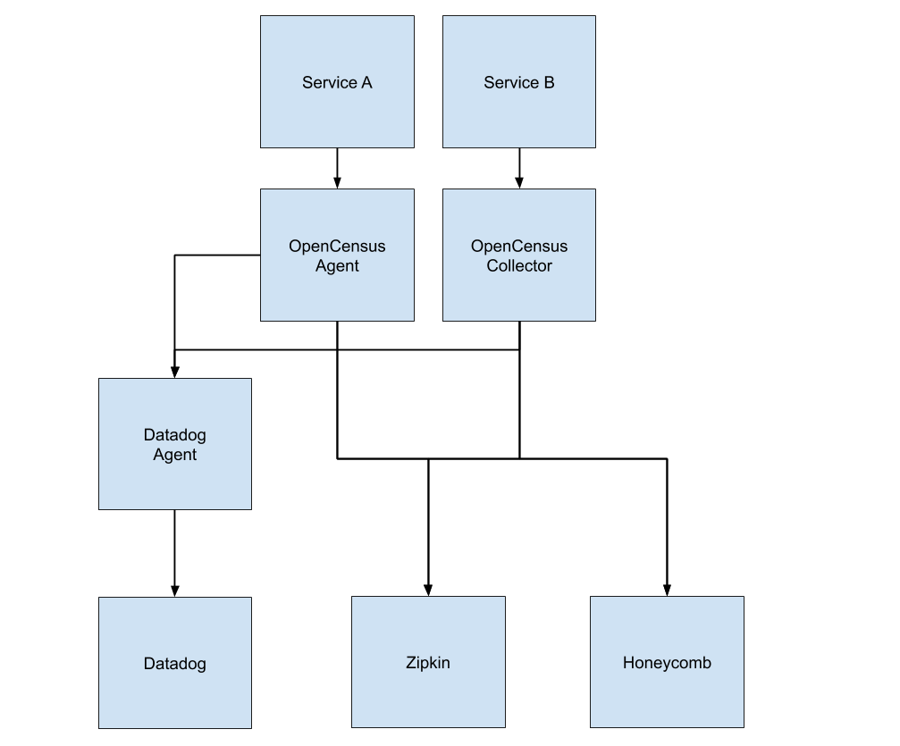

# Observability with OpenCensus

> [OpenCensus] will be superseded by [OpenTelemetry] by the end of 2019. There will be a clear migration path from OpenCensus to OpenTelemetry (see [roadmap]), so now is as good a time as any to play around with it.

This is a demonstration of how you can use the OpenCensus [agent] and [collector] (collectively called [OpenCensus Service]) to export distributed traces from your services to various backends (Zipkin, Datadog, and Honeycomb in this example, [more exporters are available][exporters]).

You instrument your services using the OpenCensus library - which is provided for a range of languages, this example uses node - and configure an exporter to send traces to the agent/collector, which then sends the traces off to your configured backends. In theory, this means you've achieved vendor independent traces 🎉

**caveat 1:** Due to a limitation/bug in the jaeger ([#551] - havent' verified this bug yet as I haven't set up Jaeger) and datadog ([#198]) exporters this example is running an agent/collector per service - the bug causes them to drop the service name you've specified in your application and will instead show up as *opencensus-app* which isn't very helpful.

**caveat 2:** In the example I'm running one collector and one agent - the collector could just as well have been an agent but I wanted to see the collector in action as well. You could also have chosen just to run a single agent or collector, but that won't work because of caveat 1. The collector has more features, so read up on both to see which one matches your requirements best.

**caveat 3:** The Honeycomb and Datadog exporters are disabled by default as you need to have an account at the appropriate vendor. Follow the instructions in each of the relevant sections below if you want to enable them.

## Table of contents

- [Requirements](#requirements)
- [Service overview](#service-overview)
- [Running it](#running-it)
- [Exporters](#exporters)
  - [Zipkin](#zipkin)
  - [Datadog](#datadog)
  - [Honeycomb](#honeycomb)
- [TODO](#todo)

## Requirements

You need to have the following tools installed on your machine:

- node (tested using 10.15.1) / npm: The two services, service a and service b, are written in node and I didn't "dockerize" them yet.
- docker & docker-compose: Everything except the two node services are running as docker containers.

## Service overview

Once everything is up and running you'll have the following services running on your machine. The arrow represents the flow of the traces; how they get from your services to your configured backends.



The following provides an overview of the relevant URLs and ports that are exposed once everything is up and running:

| Service | Description | Port | Endpoint |
| - | - | - | - |
| **Infrastructure** |  |  |  |
| Zipkin |  UI | 9411 | http://localhost:9411 |
| Datadog agent |  |  | |
| **Service a** | | | |
|servica-a | Node service | 8080 | http://localhost:8080 |
| OpenCensus agent| Receiver | 55676 |
| OpenCensus agent | ZPages | 55677 | http://localhost:55677/debug/tracez |
| **Service b** | | | |
|servica-b | Node service | 8081 | http://localhost:8081/sleep |
| OpenCensus collector| Receiver | 55678 |
| OpenCensus collector | ZPages | 55679 | http://localhost:55679/debug/tracez |

## Running it

Start all the services:

```
docker-compose up
```

Start the node services.

```
npm install
node src/service-a.js # in one tab
node src/service-b.js # in another tab
```

Fire off a few requests

```
sh/send-requests.sh
```

Go to the Zipkin UI to check out the traces - they should appear within a minute or two.

## Exporters

A quick note on each of the exporters that have been configured in this prototype.

### Zipkin

The Zipkin exporter just works™️ so there's not much to say about it. It's available at http://localhost:9411.

### Datadog

**caveat 4:** Specifying a service name for the datadog exporter only works if you're using a docker image that includes my patch ([#602]). You'll have to build the image locally I'm afraid 😞

The Datadog exporter works by forwarding traces to the Datadog agent you have running in your environment - so you still need to have that running. The Datadog agent needs to have APM enabled.

To enable the exporter follow these instructions:

1. Comment in the `datadog-agent` section in `docker-compose.yml`.
1. Put in your API key where it says `PUT_DD_API_KEY_HERE`.
1. Comment in the `datadog` section in both `etc/ocagent-service-a.yml` and `etc/occollector-service-b.yml`.

### Honeycomb

The Honeycomb exporter just works™️ - but you do need to have an account. So create an account and follow these instruction:

1. Comment in the `honeycomb` section in both `etc/ocagent-service-a.yml` and `etc/occollector-service-b.yml`.
1. Fill out values for `PUT_HONEYCOMB_WRITE_KEY_HERE` and `PUT_HONEYCOMB_DATASET_NAME_HERE`.

## TODO

The following are things I'd like to add to this example, but haven't gotten around to yet.

- Add Jaeger as a backend.
- Enhance the express integration so the route (with variable) is preserved as the span name?
- Add Redis as a dependency of one of the services to get a slightly more interesting trace.
- Extend the example to also use metrics.

[OpenCensus]: https://opencensus.io
[OpenTelemetry]: https://opentelemetry.io
[roadmap]: https://medium.com/opentracing/a-roadmap-to-convergence-b074e5815289
[OpenCensus Service]: https://opencensus.io/service/
[exporters]: https://opencensus.io/service/exporters/
[agent]: https://opencensus.io/service/components/agent/
[collector]: https://opencensus.io/service/components/collector/
[Zipkin]: https://zipkin.io
[#198]: https://github.com/census-instrumentation/opencensus-service/issues/198
[#551]: https://github.com/census-instrumentation/opencensus-service/issues/551
[#602]: https://github.com/census-instrumentation/opencensus-service/pull/602
